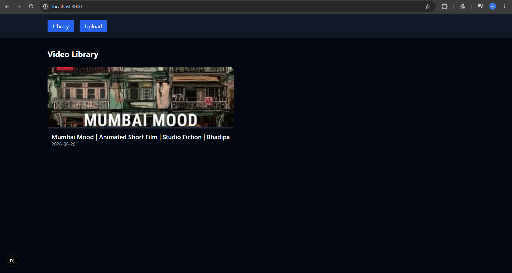
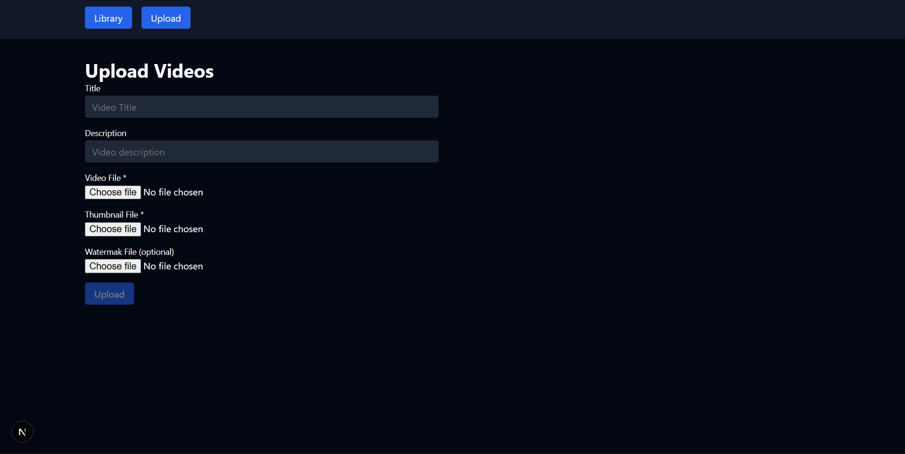

# Next.js Video Player

<p align="center">
  
  <br /><br />
  
  <br /><br />
  
</p>

A full-stack video management platform built with Next.js, TypeScript, and ImageKit. The application allows users to upload videos, manage them through a video library, and watch them on a dedicated playback page with optimized delivery powered by ImageKit.

## Features

- Upload videos directly to ImageKit
- Browse videos in a video library
- Dedicated watch page for playback
- Automatic thumbnail generation
- Video quality optimization and transformations
- Built with Next.js App Router and TypeScript

## Tech Stack

- Next.js
- TypeScript
- ImageKit

## Getting Started

```bash
git clone https://github.com/Athar9373/video-player-nextjs.git
cd video-player-nextjs
npm install
npm run dev
```

Create a `.env.local` file:

```env
NEXT_PUBLIC_IMAGEKIT_URL_ENDPOINT=your_imagekit_url_endpoint
IMAGEKIT_PUBLIC_KEY=your_public_key
IMAGEKIT_PRIVATE_KEY=your_private_key
```

## About

This project explores media management in Next.js, including video uploads, optimized streaming, thumbnail generation, and dynamic video transformations using ImageKit.

## Tags

`nextjs` `typescript` `tailwindcss` `imagekit` `video-player` `video-streaming` `media-management` `app-router` `full-stack` `react`
